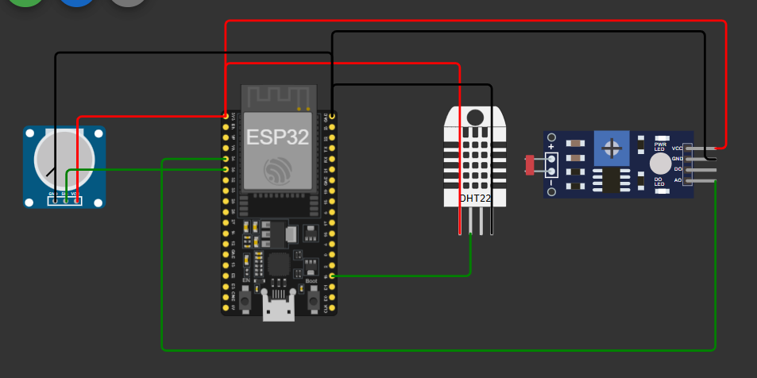
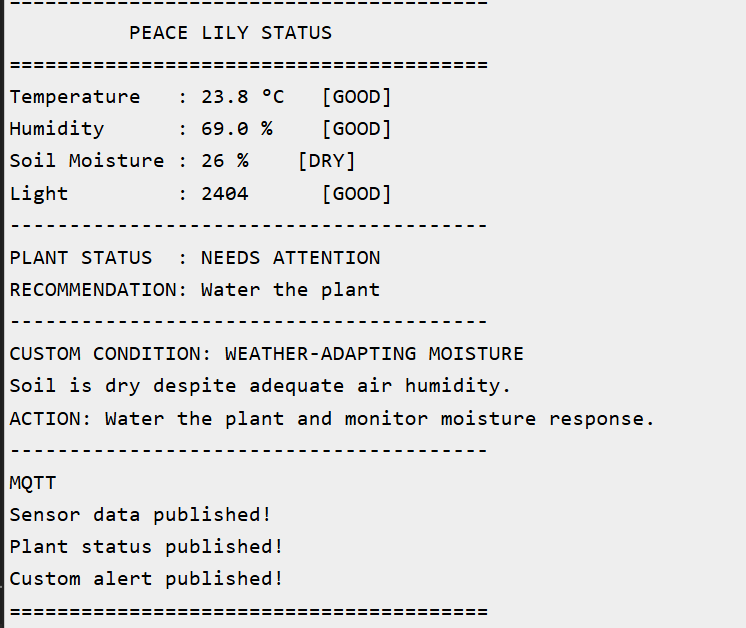
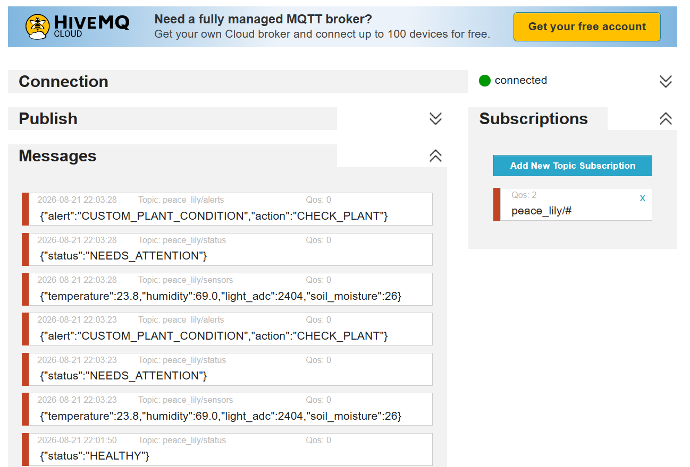

# Smart Peace Lily – IoT-Based Plant Wellness Monitoring System

## 1. Overview
An IoT-based plant wellness monitoring system using ESP32 and MQTT to monitor temperature, humidity, light intensity and soil moisture of a Peace Lily. The system compares readings with defined thresholds, determines the overall plant status and generates alerts when attention is required.

## 2. Problem Statement
Plant health depends on suitable temperature, humidity, light and soil moisture. These conditions can change continuously and may not be noticed by the user. This project provides continuous monitoring and converts sensor readings into meaningful plant-health information.

## 3. Approach
The ESP32 reads the DHT22, LDR module and potentiometer. Each value is compared with its threshold and classified as GOOD or unsuitable. The results are combined into an overall `HEALTHY` or `NEEDS_ATTENTION` status. A custom multi-parameter condition is also checked, and all information is transmitted through MQTT.

## 4. Components and Pin Connections

| Component | Purpose | ESP32 Pin |
|---|---|---|
| ESP32 | Main controller & Wi-Fi | — |
| DHT22 | Temperature & humidity | GPIO 15 |
| LDR Module | Light intensity | GPIO 34 |
| Potentiometer | Simulated soil moisture | GPIO 35 |

VCC and GND of the sensors are connected to the ESP32 supply and common GND.

A physical soil-moisture sensor was not used in the simulation. A potentiometer was used to simulate its analog output so that different soil conditions could be tested.

## 5. Threshold Reasoning and Calculation

The thresholds represent the desired operating conditions of a Peace Lily. Temperature and humidity are directly provided by the DHT22, while the LDR and potentiometer produce analog values that require interpretation.

| Parameter | Selected Range | Decision |
|---|---|---|
| Temperature | 20–28 °C | Below/above → TOO LOW/HIGH |
| Humidity | 40–70 % | Below/above → TOO LOW/HIGH |
| Soil Moisture | 30–70 % | Below → DRY; above → TOO WET |
| Light ADC | 1234–2404 | Below → TOO BRIGHT; above → TOO DARK |

**Temperature:** The DHT22 directly gives °C, so the reading is compared with `20–28 °C`: 20–28 °C is GOOD.

**Humidity:** The DHT22 directly gives %, so `40–70 %` is considered adequate humidity.

**Soil Moisture:** The potentiometer ADC value ranges from 0–4095 and is mapped to 0–100%:

`Soil Moisture (%) = ADC × 100 / 4095`

For the selected 30–70% range:

`30% → 30 × 4095 / 100 ≈ 1229 ADC`

`70% → 70 × 4095 / 100 ≈ 2867 ADC`

Therefore:

- 0–30% → DRY → Water plant
- 30–70% → GOOD
- 70–100% → TOO WET → Avoid overwatering

**Light Threshold Calculation:** The LDR light level was varied in Wokwi using lux values, while the ESP32 recorded the corresponding ADC output (0–4095). The observed readings were:

| Light Level (lux) | LDR ADC |
|---:|---:|
| 0.1 | 4063 |
| 14 | 3272 |
| 60 | 2404 |
| 105 | 2012 |
| 120 | 631 |
| 331 | 1234 |
| 3802 | 297 |
| 9549 | 33 |
| 13000 | 134 |

From these observations, the desired indirect-light region was selected using the corresponding ADC range of **1234–2404**.

Therefore:
- `< 1234` ADC → TOO BRIGHT
- `1234–2404` ADC → GOOD
- `> 2404` ADC → TOO DARK

The code uses `1234` and `2404` as the practical ADC thresholds. The lux values were used to vary the simulated light level, while the threshold comparison is performed using the LDR's ADC output.

## 6. Custom Condition and Overall Plant Status

The system includes a custom condition:

`Soil Moisture < 30% AND Humidity ≥ 40%`

This identifies dry soil despite adequate air humidity and produces:

`DRY_SOIL_ADEQUATE_HUMIDITY`

`Action: WATER_PLANT`

The overall status starts as `HEALTHY` and changes to `NEEDS_ATTENTION` if any monitored parameter is outside its acceptable range. This gives the user one clear plant-level result instead of interpreting every reading separately.

## 7. MQTT Communication

MQTT is used to transmit the monitoring information through three separate topics:

| Topic | Information |
|---|---|
| `peace_lily/sensors` | Temperature, humidity, light ADC, soil moisture |
| `peace_lily/status` | Overall plant status |
| `peace_lily/alerts` | Custom alert and action |

Example messages:

`{"temperature":26.2,"humidity":43.5,"light_adc":1001,"soil_moisture":0}`

`{"status":"NEEDS_ATTENTION"}`

`{"alert":"DRY_SOIL_ADEQUATE_HUMIDITY","action":"WATER_PLANT"}`

Separate topics keep sensor data, status and alerts organized.

## 8. Observed Sensor Values and Results

During simulation:

| Parameter | Observed Value | Result |
|---|---:|---|
| Temperature | 26.2 °C | GOOD |
| Humidity | 43.5 % | GOOD |
| Light ADC | 1001 | TOO BRIGHT |
| Soil Moisture | 0 % | DRY |
| Overall Status | — | NEEDS_ATTENTION |

The system correctly identified dry soil and excessive light, generated the required actions and triggered the custom dry-soil/adequate-humidity alert. MQTT messages were successfully published.

## 9. Circuit and Output Screenshots

## 10. Challenges Faced

- A potentiometer was used to simulate the soil-moisture sensor.
- Analog outputs required conversion/calibration before threshold comparison.
- MQTT communication was separated into sensor, status and alert topics.
- Different simulated conditions were tested to verify the decision logic.

## 11. Future Improvements

- Replace the potentiometer with a physical capacitive soil-moisture sensor.
- Add an OLED/LCD or mobile dashboard.
- Add automatic watering using a pump and relay.
- Store historical readings and provide notifications for critical conditions.

## 12. Conclusion

The project demonstrates an ESP32-based IoT system that interprets environmental conditions rather than simply displaying sensor readings. It uses defined thresholds, produces an overall plant status, detects a custom multi-parameter condition and communicates the results through MQTT. The system can be extended into an automated plant-care solution using physical sensors and actuators.
